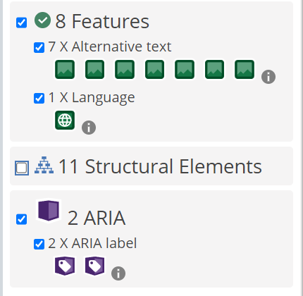

# T4.1LopezDavid
Web simple creada para la asignatura de interfaces, buscando la práctica de js, la accesibilidad y la UX, y el uso de figma.

Para dar accesibilidad a la web se han implementado atributos alt en las imágenes y aria-label para el botón de menú y de desplazamiento del carrusel.

Algunas leyes de UX que se han respetado en la web para mejorar la experiencia de usuario son:

### LEY DE FITTS:
En la página de contacto se ha usado un gran tamaño para los box de contacto con el objetivo de atraer la atención del que visita la web

### LEY DE JAKOB: 
El menú sigue una estructura convencional e intuitiva para todos.

### LEY DE LA PROXIMIDAD + LEY DE LA SEMEJANZA: 
En los elementos de la galería es fácil relacionarlos porque comparten un mismo espacio y características y aunque la galería no se presenta como tal el ojo humano entiende a que se dedica ese espacio.

[Enlace al figma](https://www.figma.com/file/e11LHEjReQ4WTmjiY7snnq/T4.1LopezDavid?type=design&node-id=0-1&mode=design)

[Ver la web deployada](https://lbdavid17.github.io/T4.1LopezDavid/)

